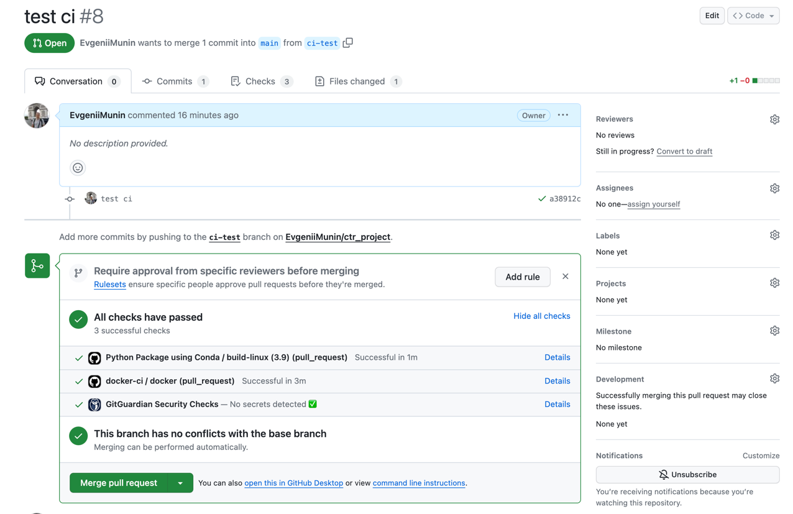

# kubernetes


## Sem2. Kubernetes

В этом занятии мы научимся работать с Kubernetes и поднимем с помощью него REST 
сервис с прошлого [курса](https://github.com/EvgeniiMunin/ctr_project).

Для деплоя мы попрактикуемся со следующими манифестами
- поднимем один под и пробросим порты для доступа клиента к нему
- поднимем `ReplicaSet` и запустить сервис на нескольких подах распределенно
- поднимем под с ограничениями на ресурсы с помощью `requests`, `limits`
- поднимем `Service` с балансировщиком нагрузки с клиента на поды

### Установка `kubectl` и подключение к кластеру
Подробная инструкция к подключению к k8s кластеру доступна в документации [VKCloud](https://cloud.vk.com/docs/base/k8s/connect/kubectl#9959-tabpanel-0)

```bash
# install k8s cli
brew install kubernetes-cli
kubectl version

# install and activate client-keystone-auth
curl -sSL \\n  https://hub.mcs.mail.ru/repository/client-keystone-auth/latest/linux/client-install.sh \\n| bash
source "/Users/evgeniimunin/.zshrc"

# export and check env vars
source openrc.sh
echo $OS_PASSWORD
echo $OS_PROJECT_ID

# define kubeconfig
sudo chmod 0600 /path/to/kubeconfig.yaml
export KUBECONFIG=/path/to/kubeconfig.yaml
echo $KUBECONFIG

# check cluster connection
kubectl cluster-info
```

### Основные команды

```bash
# create and switch namespace
kubectl create namespace ctr-app
kubectl config set-context --current --namespace=ctr-app

# apply manifest config
kubectl apply -f kubernetes/service.yaml

# forward ports from pod running on remote node to localhost
kubectl port-forward pod/ctr-app-kube 8000:8000

# get info about k8s cluster
kubectl cluster-info
kubectl get namespaces
kubectl get nodes

# get list of pods/ replica sets/ services and their status
kubectl get pods
kubectl get rs

# get detailed info on particular pod/ replica set/ service
kubectl describe service ctr-service
kubectl describe pod ctr-app

# delete pod/ replica set/ service
kubectl delete rs ctr-app

```

### Результаты

Для визуального отображения элементов кластера k8s мы воспользуемся приложением [Lens](https://k8slens.dev/)

Ноды в кластере k8s VKCloud


Запущенный под в кластере и его лог после обработки запросов клиента


Replica Set из 4х подов


Сервис Load Balancer


## Sem3. Terraform
На предыдущем занятии мы подняли кластер k8s через из [личного кабинета](https://cloud.vk.com/docs/ru/base/k8s/operations/create-cluster/create-webui)
Это удобно до тех пор, пока наша инфраструктура содержит одно или несколько приложений. 
Но что если мы используем каскад из нескольких моделей-сервисов + сервисов с бизнес логикой, и например, 
после обновления версии Python их нужно все передеплоить? Здесь нам на помощь приходит Terraform.


### Установка `terraform` VKCloud 
- Установим terraform c официального [зеркала](https://hashicorp-releases.mcs.mail.ru/terraform/1.6.1/) от VK Cloud. 
В нашем случае мы установим версию `1.6.1_darwin_amd64`. После скачивание исполним .exe файл
- В настройках проекта в личном кабинете переходм на вкладку Terraform.
Скачиваем файлы `vkcs_provider.tf` и `terraform.rc`. Переименовываем `terraform.rc` в `.terraformrc` 
и помещаем в корень домашней директории пользователя (туда, где находятся `.zshrc` для Mac или `.bashrc`для Linux).
Файл `vkcs_provider.tf` переносим в рабочую директорию проекта. Он будет необходим для подключения к проекту внутри `vkcs`


- Далее прописываем файл конфига [network.tf](https://github.com/EvgeniiMunin/ctr_project_part2/blob/main/terraform/network.tf) для настройки сети k8s кластера: сеть, подсеть, маршрутизатор
- Для того, чтобы описать k8s кластер пропишем конфиг [main.tf](https://github.com/EvgeniiMunin/ctr_project_part2/blob/main/terraform/main.tf).
Здесь мы указываем регион Москва и зону доступности `GZ1`. Версия k8s `1.26`, один мастер узел `STD3-4-8`, два worker-узла `STD-2-4`
- После того, как мы прописали конфиги, запустим следующие команды terraform

```bash
# инициализирует рабочий каталог terraform
terraform init
# генерирует файл изменений и показывает, что изменится при запуске
terraform plan
# строит или изменяет инфраструктуру. При запросе подтверждения введите yes
terraform apply 
```

- Создание кластера займет около 25 мин. После завершения мы сможем увидеть в личном кабинете node группу и сам кластер.


### Деплой `ctr-app`
Чтобы проверить, что наш кластер работает успешно, развернем приложение `ctr-app` в виде [ReplicaSet](https://github.com/EvgeniiMunin/ctr_project_part2/blob/main/kubernetes/replica_set.yaml), как мы это делали на прошлом занятии.

```bash
# check the cluster is ready
kubectl get nodes
kubectl get namespaces

# deploy ctr-app replica_set
kubectl apply -f replica_set.yaml
kubectl describe pod ctr-app-kube-bxm74
kubectl get pods
```

Здесь мы увидим, что 4 пода (реплики) развернуты на двух машинах. Далее запустим [клиент](https://github.com/EvgeniiMunin/ctr_project_part2/blob/main/online_inference/make_request.py)
и проверим работу сервиса. Мы увидим, что поды возвращают ответ 200 и клиенту приходят предсказания модели.


## Sem5. CI/CD. ArgoCD
В этом занятии мы разберем механизмы Continuous Integration CI и Continuous Delivery CD.
- **CI**. После каждого коммита запускаются автотесты. 
Каждый пуш в `main` сопровождается автоматической сборкой Docker образа и его записью в Docker Hub.
- **CD**. Когда новая версия Docker образа собрана и запушена в Docker Hub,
мы можем развернуть приложение k8s с этой новой версией образа. 
Создаются поды с новой версией, при этом поды со старой версией закрываются.

Для настройки CI мы воспользуемся двумя workflow
- [python.yaml](https://github.com/EvgeniiMunin/ctr_project/blob/main/.github/workflows/python-package-conda.yml) 
для запуска автотестов и линтера, который триггериться после коммита в PR
- [docker-ci.yaml](https://github.com/EvgeniiMunin/ctr_project/blob/main/.github/workflows/docker-ci.yml)
для сборки и записи Docker образа в Docker Hub. Workflow триггериться после коммита в PR (при этом образ записывается с тэгом `pr-*`)
а также после коммита в `main` (в этом случае тэг имеет аналогичное название)



Для настройки CD мы воспользуемся инструментов [ArgoCD](https://argo-cd.readthedocs.io/en/stable/).
Здесь нашей задачей будет сделать так, чтобы версия развернутого на кластере k8s приложения менялась
автоматически после коммита изменений в манифест в `main` ветке.

Для того чтобы запустить ArgoCD подготовим следующие манифесты

- [Deployment](https://github.com/EvgeniiMunin/ctr_project_part2/blob/main/argocd/app/deploy_manifest.yaml) c указанием образа в Docker Hub, который будем вытягивать для запуска
а также количество реплик подов в ReplicaSet
- [Service](https://github.com/EvgeniiMunin/ctr_project_part2/blob/main/argocd/app/service.yaml) для проброски URL адреса на весь ReplicaSet целиком
- [Application](https://github.com/EvgeniiMunin/ctr_project_part2/blob/main/argocd/app.yaml), где указываем Git репозиторий, с которым мы будем синхронизировать приложение,
адрес k8s кластера и политику синхронизации и закрытия приложения.
Также в манифесте приложения мы указываем путь до манифестов Deployment, Service, чтобы ArgoCD их нашел на Github.

### Основные команды

```bash
kubectl create namespace argocd

# install argocd and init password
kubectl apply -n argocd -f https://raw.githubusercontent.com/argoproj/argo-cd/stable/manifests/install.yaml
argocd admin initial-password -n argocd

# forward ports and access argocd UI
kubectl port-forward svc/argocd-server -n argocd 8080:443

# run argocd app and deploy ctr_app
kubectl apply -f app.yaml 

# get external-ip address to send requests to ctr_app Service
kubectl get services -n kuber
```

### Результаты

После запуска ArgoCD приложения, оно вместе с подами должно отобразиться в UI.


Если мы запустим клиент по URL сервиса, то в логах подов сможем увидеть ответы на запросы.


Мы заменили версию Docker образа `ctr_online_inference:v3` на `ctr_online_inference:v4`. 
После коммита в `main` ветку, можем видеть, как ArgoCD приложение синхронизируется с новым мейном,
создавая новые поды с версией образа `v4` и закрывая старые.
